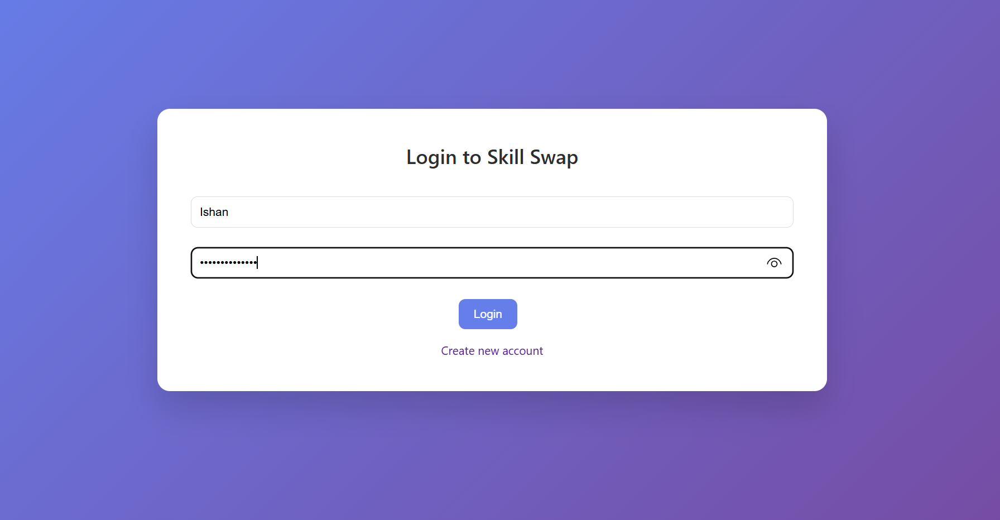
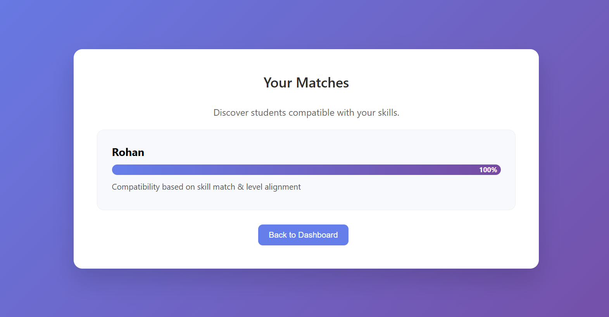
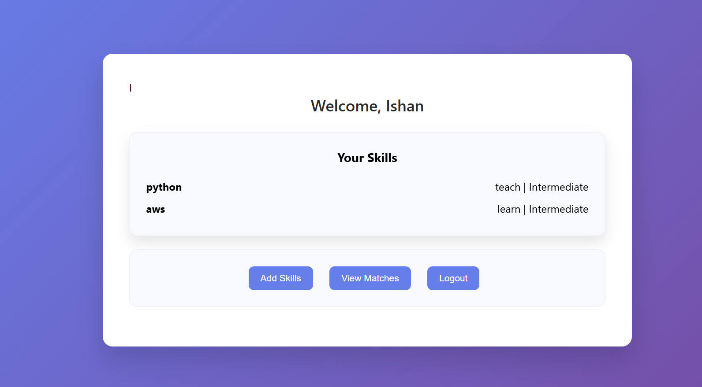

# SkillMatch Platform

SkillMatch is a full-stack web application that connects students based on the skills they can teach and learn. The platform intelligently matches users using a level-based compatibility system and displays match scores visually.

---

## 🚀 Features

- User Authentication (Register / Login / Logout)
- Session-based access control
- Add skills under:
  - Teach
  - Learn
- Skill proficiency levels:
  - Beginner
  - Intermediate
  - Advanced
- Level-aware bidirectional matching algorithm
- Compatibility scoring system
- Interactive dashboard
- Modern UI with animations and progress bars

---

## 🧠 Matching Logic

The platform matches users based on:

1. Skill name intersection
2. Level hierarchy validation  
   (Beginner < Intermediate < Advanced)
3. Bidirectional comparison:
   - User A teaches what User B wants to learn
   - User B teaches what User A wants to learn
4. Score calculation based on compatibility strength
5. Visual percentage-based match display

---

## 🛠 Tech Stack

- Python
- Flask
- SQLite
- HTML
- CSS
- Git & GitHub

---

## 📂 Project Structure

## 📸 Screenshots

### Dashboard

### Matches

##Login

